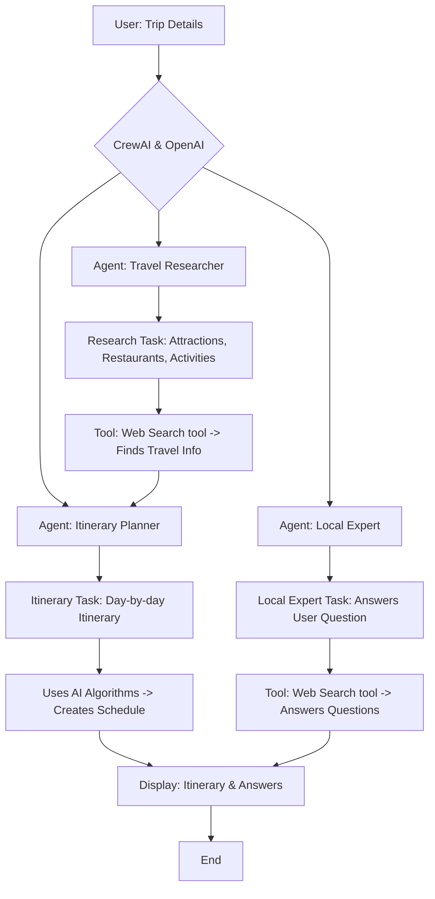

```mermaid
graph TD
    A[User: Trip Details] --> B{CrewAI & OpenAI};
    B --> C[Agent: Travel Researcher];
    B --> D[Agent: Itinerary Planner];
    B --> E[Agent: Local Expert];
    C --> F[Research Task: Attractions, Restaurants, Activities];
    D --> G[Itinerary Task: Day-by-day Itinerary];
    E --> H[Local Expert Task: Answers User Question];
    F --> I[Tool: Web Search tool -> Finds Travel Info];
    G --> J[Uses AI Algorithms -> Creates Schedule];
    H --> K[Tool: Web Search tool -> Answers Questions];
    I --> D;
    J --> L[Display: Itinerary & Answers];
    K --> L;
    L --> M[End];
    style B shape diamond
```
